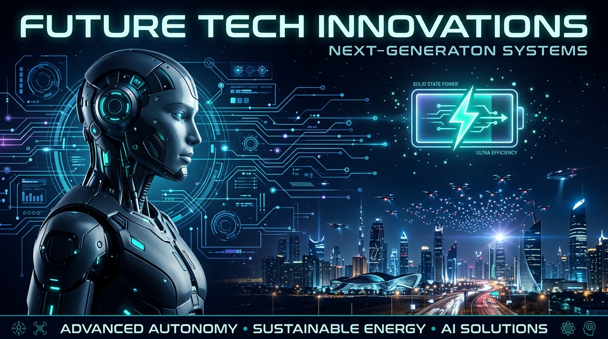

# 🚀 Yarının Yarışları (Races of Tomorrow) | The Next Era of Deep-Tech



> "Bugünün popüler konularına değil; 5 yıl, 10 yıl sonrasının teknolojilerine, yarının yarışlarına şimdiden hazırlanın. Teknoloji lineer büyümez; eksponansiyel patlamalarla çağ atlar."

Bu depo, günübirlik yazılım trendlerinin, hantal kurumsal yapıların ve geleneksel mühendislik paradigmalarının çok ötesine bakmak için inşa edilmiştir. **Yarının Yarışları**, 2030 ve sonrasının derin teknoloji (deep-tech) standartlarını sıfırdan kurgulayan bağımsız bir araştırma, mimari ve geliştirme merkezidir.

Buradaki vizyon; yazılımın sadece donanımı yönettiği değil, donanımla simbiyotik bir ilişki kurduğu, algoritmaların buluta ihtiyaç duymadan uç cihazlarda (edge) uyandığı ve sistemlerin kendi kendini organize ettiği yeni bir dünya düzeninin çekirdek kodlarını yazmaktır.

---

## 🔮 Gelecek Projeksiyonu: 2030 - 2050 Vizyonu

Bu depo, önümüzdeki 20 yılın teknolojik darboğazlarını aşmak üzere tasarlandı. Odaklandığımız ana teknolojik sıçrama noktaları şunlardır:

### 1. Kognitif Uç Yapay Zeka (Cognitive Edge-AI) ve Bedenlenmiş Zeka
Bulut bilişim dönemi, gecikme (latency) ve veri mahremiyeti sınırlarına dayandı. Gelecek, "Bedenlenmiş Yapay Zeka" (Embodied AI) mimarisindedir. Milyarlarca parametreli Büyük Dil Modellerinin (LLM), kuantizasyon ve bare-metal optimizasyonlarla doğrudan mikrodenetleyicilerde (MCU) ve nöromorfik çiplerde çalışabilmesini sağlayan altyapılar burada inşa ediliyor.

### 2. Otonom Sürü Zekası (Autonomous Swarm Orchestration)
Merkezi bir sunucuya bağımlı robotik sistemlerin yerini, doğadaki sürü zekasını taklit eden merkeziyetsiz yapılar alıyor. Yüzlerce otonom sistemin birbirleriyle mikrosaniyeler içinde iletişim kurduğu, engelleri aşmak veya bir görevi tamamlamak için dinamik olarak lider-takipçi ilişkisi kurabildiği yapılar geliştiriyoruz.

### 3. Katı Hal (Solid-State) Enerji ve Donanım-Yazılım Entegrasyonu
Yazılım ne kadar gelişirse gelişsin, fiziksel dünyadaki sınırı enerji belirler. Katı hal bataryalarının devrim yarattığı, günlerce kapanmadan çalışabilen otonom sistemler için, enerji tüketimini mikrowatt seviyesinde yöneten akıllı uyku (deep-sleep) durumları bu projenin temel taşlarındandır.

---

## 🇨🇳 Doğu'nun Eksponansiyel İvmesi: Çin'in Gelecek Projeksiyonu

Küresel derin teknoloji savaşlarının ve seri üretimin kalbi olan Asya-Pasifik ekosisteminde (özellikle Çin merkezli) yürütülen gizli ve açık devrimler, bu reponun mimarisine doğrudan ilham vermektedir. Geleneksel Batı odaklı yazılım dünyası yüzeysel uygulamalara odaklanırken, Doğu ekosistemi şu alanlarda geleceği inşa etmektedir:

### 🤖 1. Bedenlenmiş Yapay Zeka ve Kitlesel Robotik Üretimi (Embodied AI & Humanoid Scaling)
*   **Donanım + Zeka Entegrasyonu:** Çin, insansı robotları (Unitree, AgiBot, UBTECH vb.) sadece laboratuvar projesi olarak değil, sanayi bantlarına inecek devasa bir "fiziksel iş gücü" olarak ölçeklendiriyor.
*   **Çekirdek Odak:** LLM'lerin sadece metin üretmesi değil, robotik eklemleri, tork sensörlerini ve alan algısını anlık olarak yönetebilmesi. Yapay zeka doğrudan kas ve sinir sistemine dönüştürülüyor.

### 🔋 2. "Yeni Güç" ve Katı Hal Batarya Devrimi (Solid-State Batteries)
*   **Enerji Yoğunluğunda Kuantum Sıçraması:** CATL, BYD ve WeLion öncülüğünde 500+ Wh/kg enerji yoğunluğuna ulaşan katı hal bataryaları, otonom araçların ve robotların menzil/çalışma süresi kısıtlamalarını tamamen kaldırıyor.
*   **Kesintisiz Otonomi:** Yanma riski sıfırlanmış, ultra yüksek yoğunluklu hücreler sayesinde otonom hava ve kara araçları için günlerce süren kesintisiz operasyon çağı başlıyor.

### 🔌 3. RISC-V Mimarisi ve Silikon Bağımsızlığı
*   **Açık Kaynak Donanım:** Küresel çip ambargolarına yanıt olarak Çin, x86 ve ARM mimarilerine olan bağımlılığı kırıp tüm işlemci altyapısını açık kaynaklı **RISC-V** mimarisine kaydırıyor.
*   **Özelleştirilmiş Çipler:** Belirli bir yapay zeka algoritması için özel olarak üretilen (ASIC/NPU) ucuz ve ultra verimli silikon yapılar, uç cihazlarda devrim yaratıyor.

### 🛸 4. Uzay Tabanlı Uç Bilişim ve Düşük İrtifa Ekonomisi (Low-Altitude Economy)
*   **Orbit-AI:** Yörüngedeki uyduların veriyi ham olarak dünyaya indirmek yerine, uzayda kendi üzerindeki yapay zeka çipleriyle işleyip sadece sonucu göndermesi (Space-Edge).
*   **Otonom Şehir Lojistiği:** eVTOL (elektrikli dikey kalkış-iniş yapan araçlar) ve otonom drone filoları için gökyüzünde otonom trafik kontrol protokollerinin kurulması.

---

## 🛠️ Sistematik Arşiv ve Modül Matrisi

Kod tabanı ve araştırmalar, donanım seviyesinden en üst düzey bilişsel soyutlamalara kadar katmanlı bir mimaride organize edilmiştir:

| Dizin | Odak Alanı | Teknolojik Kapsam | Temel Dosyalar |
| :--- | :--- | :--- | :--- |
| `01_bare_metal_core/` | Donanımla doğrudan temas eden, işletim sistemsiz (OS-less) çekirdek rutinler. | `C++20/23`, Pointers, Register-Level Control, PID, LPF, RVV 1.0 | [bsp_register_map.h](file:///g:/Di%C4%9Fer%20bilgisayarlar/Diz%C3%BCst%C3%BC%20Bilgisayar%C4%B1m/github%20repolar%C4%B1m/yarinin-yarislari/01_bare_metal_core/bsp_register_map.h), [neuromorphic_control.cpp](file:///g:/Di%C4%9Fer%20bilgisayarlar/Diz%C3%BCst%C3%BC%20Bilgisayar%C4%B1m/github%20repolar%C4%B1m/yarinin-yarislari/01_bare_metal_core/neuromorphic_control.cpp), [rvv_matrix_opt.h](file:///g:/Di%C4%9Fer%20bilgisayarlar/Diz%C3%BCst%C3%BC%20Bilgisayar%C4%B1m/github%20repolar%C4%B1m/yarinin-yarislari/01_bare_metal_core/rvv_matrix_opt.h) |
| `02_cognitive_edge/` | Uç cihazlarda (Edge) çalışan yapay zeka modelleri ve inferans motorları. | `Python`, Quantized Weights, RNN Feedback Dynamics, JSON | [inference_engine.py](file:///g:/Di%C4%9Fer%20bilgisayarlar/Diz%C3%BCst%C3%BC%20Bilgisayar%C4%B1m/github%20repolar%C4%B1m/yarinin-yarislari/02_cognitive_edge/inference_engine.py), [weights_config.json](file:///g:/Di%C4%9Fer%20bilgisayarlar/Diz%C3%BCst%C3%BC%20Bilgisayar%C4%B1m/github%20repolar%C4%B1m/yarinin-yarislari/02_cognitive_edge/weights_config.json) |
| `03_swarm_protocols/` | Merkeziyetsiz sistemlerin anlık iletişim ve karar alma mekanizmaları. | Artificial Potential Fields (APF), 3D Collision Avoidance, ISAC Tracking | [swarm_orchestrator.py](file:///g:/Di%C4%9Fer%20bilgisayarlar/Diz%C3%BCst%C3%BC%20Bilgisayar%C4%B1m/github%20repolar%C4%B1m/yarinin-yarislari/03_swarm_protocols/swarm_orchestrator.py), [evtol_traffic_ctrl.py](file:///g:/Di%C4%9Fer%20bilgisayarlar/Diz%C3%BCst%C3%BC%20Bilgisayar%C4%B1m/github%20repolar%C4%B1m/yarinin-yarislari/03_swarm_protocols/evtol_traffic_ctrl.py) |
| `04_energy_dynamics/` | Katı hal batarya sistemlerine özel, tüketim ve termal optimizasyon algoritmaları. | State of Health (SOH) Degradation, CPU Throttling, Thermal Safe Limits | [battery_optimizer.py](file:///g:/Di%C4%9Fer%20bilgisayarlar/Diz%C3%BCst%C3%BC%20Bilgisayar%C4%B1m/github%20repolar%C4%B1m/yarinin-yarislari/04_energy_dynamics/battery_optimizer.py) |
| `05_china_tech_watch/` | Doğu ekosistemindeki derin teknoloji sızıntıları, RISC-V ve robotik analizleri. | Ar-Ge Raporları, Patent Analizleri, OSINT İstihbaratı | [china_deep_tech_intel.md](file:///g:/Di%C4%9Fer%20bilgisayarlar/Diz%C3%BCst%C3%BC%20Bilgisayar%C4%B1m/github%20repolar%C4%B1m/yarinin-yarislari/05_china_tech_watch/china_deep_tech_intel.md) |

---

## 🔄 Simbiyotik Mimari & Veri Akışı

Bu repodaki modüller statik kütüphaneler olmaktan öte, bipedal otonom humanoid sistemlerinde birbiriyle sürekli etkileşim halinde olan dinamik bir veri akış şeması oluşturur:

```
[ Donanım Katmanı ] ──(Raw IMU/Sıcaklık)──► [ 01_bare_metal_core (LPF/PID) ]
                                                   │
                                            (Sensor Registers)
                                                   ▼
[ 04_energy_dynamics ] ◄──(Sıcaklık/SOC)── [ 02_cognitive_edge (INT4 RNN) ]
  (Throttling Limits)                              │
         │                                  (Torque Offsets)
         ▼                                         ▼
[ CPU/Motor Sürücü ] ◄────────────────────── [ Aktüatör PWM ]
```

1.  **Duyusal Algılama & Temizleme:** `01_bare_metal_core` üzerindeki Low-Pass Filter (LPF), ham IMU register'larındaki vibrasyon parazitlerini temizler.
2.  **Karar & Çıkarım:** Filtrelenmiş veri NPU bellek adreslerine yazılır. `02_cognitive_edge` altındaki INT4 yapay zeka çıkarım motoru, önceki stabilizasyon geçmişini (recurrent state) kullanarak bir sonraki adımın yörünge tork sapmasını hesaplar.
3.  **Enerji Koruma & Güvenlik:** `04_energy_dynamics` batarya hücre sıcaklığını ve SOC düşümünü izler. Eğer batarya 42°C üzerine çıkarsa CPU saat hızını (`cpu_clock_mhz`) 240MHz'den aşağıya çeker ve motor gücünü kısarak `01_bare_metal_core` PID çıkış limitlerini dinamik olarak sınırlandırır.
4.  **Sürü İşbirliği:** Robot bir sürü üyesiyse, `03_swarm_protocols` APF (Yapay Potansiyel Alanlar) ile lider robottan konum bilgisini alır, çevredeki statik engellerden kaçma vektörlerini hesaplar ve elde edilen navigasyon verilerini tork denetleyicisine iletir.

---

## 📈 Matematiksel Modeller ve Formülasyonlar

Bu depoda uygulanan simülasyon ve kontrol döngüleri, gerçek fiziksel ve elektrokimyasal formüllere dayanmaktadır:

### 1. Sinyal Filtreleme (Low-Pass Filter)
Gövde vibrasyonunu engellemek için kullanılan birinci dereceden dijital alçak geçiren filtre formülü:
\[y[n] = \alpha \cdot x[n] + (1 - \alpha) \cdot y[n-1]\]
Burada \(\alpha\) yumuşatma katsayısıdır (\(0 < \alpha \le 1\)).

### 2. Integrator Anti-Windup PID Kontrolcü
Motor sürücü aşırı yüklenmelerini engellemek için sınırlı integral birikimine sahip PID formülü:
\[u(t) = K_p \, e(t) + K_i \int_{0}^{t} e(\tau) \, d\tau + K_d \, \frac{de(t)}{dt}\]
Burada integral terim limit sınırına ulaştığında doyuma (anti-windup clamping) girer.

### 3. Yapay Potansiyel Alanlar (APF)
Sürü robotların engelden kaçarken hedefe ulaşmasını sağlayan toplam kuvvet vektörü:
\[F_{net} = F_{att} + \sum F_{rep}\]
Hedefe çekim kuvveti:
\[F_{att} = K_{att} \cdot (X_{target} - X_{robot})\]
Engele itim kuvveti (etki mesafesi \(d_0\) altındayken):
\[F_{rep} = K_{rep} \cdot \left(\frac{1}{d} - \frac{1}{d_0}\right) \frac{1}{d^2} \cdot \hat{u}_{direction}\]

### 4. Katı Hal Batarya Açık Devre Voltajı (OCV)
Anot silikon-karbon ve katı hal elektrolit doyumunu simüle eden logaritmik OCV-SOC eğrisi:
\[V_{ocv} = V_{nominal} \cdot (0.85 + 0.15 \cdot \ln(9 \cdot SOC + 1))\]

---

## 🚀 Çalıştırma ve Test Yönergeleri

### 1. Bare-Metal Kontrol Modülü
C++23 derleyicinizi kullanarak doğrudan target mikrodenetleyici mimarisine derleyin veya simülasyon başlıklarını projenize entegre edin:
```bash
# C++23 standart derleme parametreleri
g++ -std=c++23 -c 01_bare_metal_core/neuromorphic_control.cpp -o neuromorphic_control.o
```

### 2. Kognitif Uç Yapay Zeka Çıkarım Motoru
Lokal olarak INT4 kuantize ağırlık dosyasını yükleyip çıkarım döngüsünü test etmek için:
```bash
python 02_cognitive_edge/inference_engine.py
```

### 3. Sürü Simülasyonu (Engelden Kaçınma ve APF)
Uç cihazların merkeziyetsiz olarak engellerden kaçma manevralarını simüle etmek için:
```bash
python 03_swarm_protocols/swarm_orchestrator.py
```

### 4. Güvenlik Sınırlayıcılı Batarya Simülasyonu
Aşırı ısı altında bataryanın ömür (SOH) kaybını ve CPU/motor gücünü nasıl kıstığını izlemek için:
```bash
python 04_energy_dynamics/battery_optimizer.py
```

---

## 🎯 Yol Haritası: 2026 - 2030

- [x] **Faz 1:** Bare-Metal PID ve LPF denetleyici entegrasyonu, INT4 quantize recurrent çıkarım motoru.
- [x] **Faz 2:** Yapay Potansiyel Alanlar (APF) ile sürü çarpışma engelleme mekanizmaları.
- [x] **Faz 3:** Katı hal batarya hücre yaşlanma modeli (SOH) ve dinamik termal limit koruması.
- [x] **Faz 4:** RISC-V Vektör Uzantısı (RVV 1.0) için bare-metal assembly matris çarpım optimizasyonları.
- [x] **Faz 5:** Uydudan otonom eVTOL trafik protokollerinin (ISAC/5G-A) simüle edilmesi.

---

## ⚖️ Çekirdek Doktrin ve Geliştirme Felsefesi

1. **Alaylı ve Sınırsız Disiplin:** Geleneksel kalıplara, bürokratik engellere ve kısıtlayıcı müfredatlara yer yoktur. Bilgi, sahada ve donanımın tam kalbinde öğrenilir. Vizyon, bağımsız bir zihnin sınır tanımazlığıyla şekillenir.
2. **Sıfır Tolerans, Maksimum İvme:** Sistemler yazılırken "yeterince iyi" kavramı kabul edilmez. Her kod satırı, işlemci döngüsünü (clock cycle) en verimli kullanacak şekilde çıplak metale (bare-metal) kazınır.
3. **Tek Kişilik Dev Yapı (Solopreneur Optimization):** Yüzlerce kişilik karmaşık ekiplerin hantallığına karşı, yüksek zeka araçlarıyla desteklenen, tek bir vizyonerin yönettiği ölçeklenebilir ve çevik mimari.
4. **Mutlak Profesyonellik ve Tarafsızlık:** Geliştirilen sistemler evrenseldir. Endüstriyel odaklı, saf teknoloji ve mühendislik prensiplerine dayalı, tamamen profesyonel bir yaklaşımla inşa edilir.

---

### 👨‍💻 Geliştirici ve Mimar

**Bahattin Yunus Çetin**  
*Bağımsız Yazılım Geliştirici & Derin Teknoloji Mühendisi*  
**Organizasyon:** Çetin 

> *"Gelecek onu bekleyenlerin değil, satır satır kodlayanların olacaktır."*